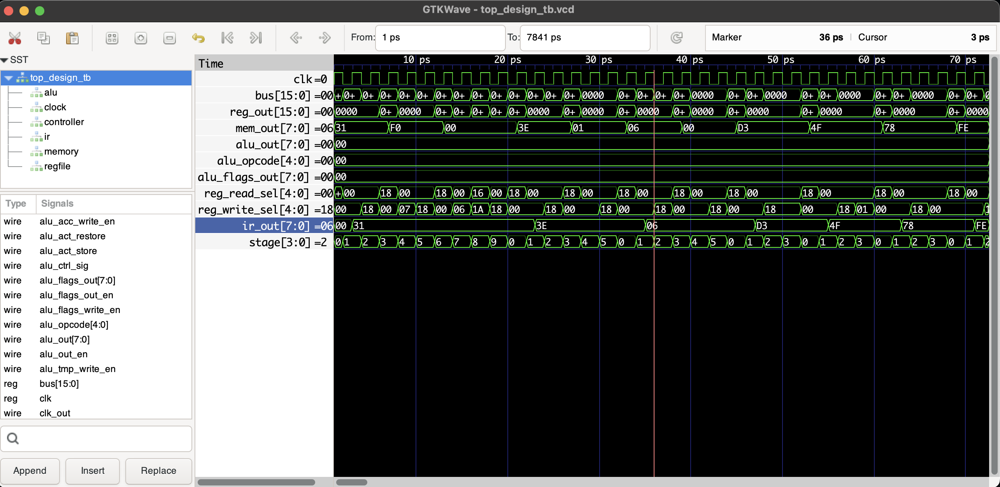

# nam80: An 8-bit computer based on the Intel 8080 ISA

This computer was based on the Intel 8080 ISA. Currently it can support most of the 8080 instructions.

You can compile an 8080 program using an [online assembler](https://rk86.ru/i8080asm.html) and run it on this computer. Load up a program to [program.bin](program.bin), then simulate the computer using the gtkwave file.

Simulation:

The toolchain: 
- [GTKWave](https://gtkwave.sourceforge.net/)
- [Icarus Verilog](https://github.com/steveicarus/iverilog)

References:
- [Digital Computer Electronics](https://www.amazon.com/Digital-Computer-Electronics-Jerald-Malvino-dp-0074622358/dp/0074622358/ref=dp_ob_title_bk)
- [Intel 8080/8085 opcode table - octal version](https://tobiasvl.github.io/optable//intel-8080/octal)
- [Intel 8080 assembly programming manual](https://altairclone.com/downloads/manuals/8080%20Programmers%20Manual.pdf)
- [Intel 8080 opcode table](https://pastraiser.com/cpu/i8080/i8080_opcodes.html)
- [Inside the Intel 8085 Register File](https://blog.adafruit.com/2013/03/07/inside-the-intel-8085-register-file/)
- [Reverse-engineering the 8085's ALU and its hidden registers](http://www.righto.com/2013/07/reverse-engineering-8085s-alu-and-its.html)
- [The 8085's register file reverse engineered](http://www.righto.com/2013/03/register-file-8085.html)
